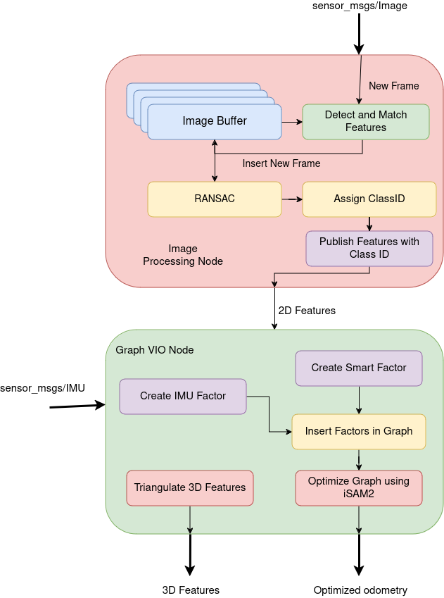
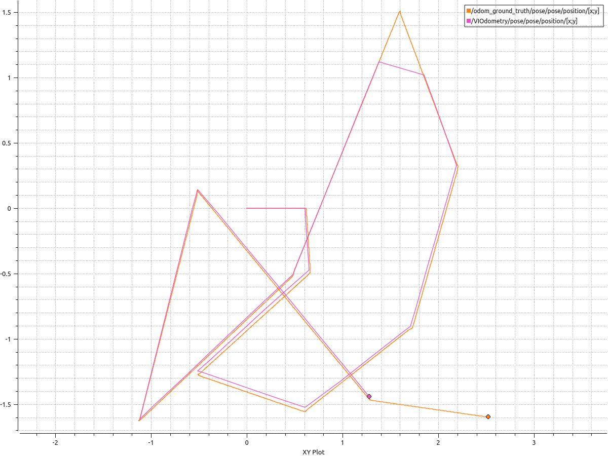

# turtlebot_vio

This ROS package is a visual-inertial odometry (VIO) system for the Turtlebot 2 using Pose Graph Optimizaiton with the help of factor graphs from GTSAM C++ Library. The package was designed in [stonefish](https://github.com/patrykcieslak/stonefish) simulator using [Turtlebot2](https://bitbucket.org/udg_cirs/turtlebot_simulation/src/master/) Simulation Packages. The package was tested on ROS Noetic running on Ubuntu 20.04 Machine.


# Overview

Visual perception is crucial for robotics applications, requiring a robust system for localization using multiple sensers for accurate state estimation. Visual-Inertial Odometry (VIO), combining a camera and Inertial Measurement Units (IMUs), offers an efficient and accurate alternative to GPS and lidar for state estimation. Cameras provide rich visual data but suffer from limitations like low output rate and prone to motion blur, while IMUs offer high-frequency measurements but accumulate drift over time. VIO leverages the complementary strengths of both sensors.This paper discusses a VIO framework implemented on a Turtlebot platform using ROS and GTSAM for incremental smoothing and mapping. The approach involves a tightly coupled VIO pipeline, integrating camera and IMU data through Smart Projection Pose Factors for efficient state estimation. The methodology includes an image processing pipeline for feature detection and matching, and a graph optimization process for pose estimation.Initial testing in a simulation environment demonstrated the effectiveness of the VIO implementation, with future improvements suggested for buffer management and sensor calibration.


# Package Architecture

<div align="center">
    
</div>


# Dependencies

* ROS Noetic
* Stonefish Simulator
* Turtlebot2 Simulation Packages
* GTSAM
* OpenCV
* Eigen3


# Installation

To install the turtlebot_vio package, follow these steps:

### Install the dependencies:
1. ROS Noetic: Follow the instructions [here](http://wiki.ros.org/noetic/Installation/Ubuntu).
2. Stonefish Simulator: Follow the instructions [here](https://github.com/patrykcieslak/stonefish)
3. Turtlebot Simulation Packages: Follow the instructions [here](https://bitbucket.org/udg_cirs/turtlebot_simulation/src/master/)
4. GTSAM Library: Follow the instructions [here](https://gtsam.org/build/)
5. OpenCV: Follow the instructions [here](https://docs.opencv.org/4.x/d7/d9f/tutorial_linux_install.html)
6. If you don't have Eigen and Boost libraries installed, you can install them using the following commands:
    ```
    $ sudo apt install libeigen3-dev
    $ sudo apt install libboost-all-dev
    ```

### Build the package:

To build the turtlebot_vio package, follow these steps:
1. Clone the repository into your ROS catkin workspace:
    ```
    $ git clone https://github.com/patweatharva/turtlebot_vio.git
    ```

2. Build the package:
    ```
    $ cd ~/catkin_ws
    $ catkin build
    ```
    if you dont have catkin tools installed, you can install it from [here](https://catkin-tools.readthedocs.io/en/latest/installing.html)

3. Source the setup file:
    ```
    $ source devel/setup.bash
    ```
    You can add this line to your `.bashrc` file to run it automatically when you open a new terminal.
    
4. If while building the package can not find the GTSAM library, provide necessary path to the library in CMakeLists.txt file. Same goes for PCL, Eigen and Boost libraries.

## Usage

### IMPORTANT!!
1. Before launching the files change which mode (SIL/HIL) is in use from the [src/config.py](/src/config.py) file and launch respective file using following instructions.

* SIL - Software in Loop when working in Simulator.
* HIL - Hardware in Loop when working on real turtlebot robot.(Not Tested)

To use the turtlebot_vio package, follow these steps:

1. Launch the package:
    ```
    $ roslaunch turtlebot_vio turtlebot_poster_env.launch
    ```
    This will launch the turtlebot_vio node and the stonefish simulator with the turtlebot in the poster environment.

Once the simulation is running, you can visualize the VIO output using RViz. The graph starts optimization process after atleast two keyframes are added thus start moving the robot using the teleop package. You can use the following command to run the teleop node:
```
rosrun teleop_twist_keyboard teleop_twist_keyboard.py
```

If you don't have the teleop_twist_keyboard package installed, you can install it from [here](http://wiki.ros.org/teleop_twist_keyboard)


If you want the run different environment, you can launch following launch file

```
$ roslaunch turtlebot_vio env.launch
```

## Results

Following plot shows the Ground Truth and Estimated Trajectory of the Turtlebot in the Poster Environment.

<div align="center">
    
</div>

Following plot shows the 3D features extracted from the camera images.

<div align="center">
    
</div>

<div align="center">
    
</div>


The detailed results and analysis can be found in the [Report](/resources/IEEE_Hands_On_Perception.pdf) file.

**The video of the testing can be found on [YouTube](https://youtu.be/Ck7xUBVUsjw?si=ubARTHcDRD40PmBO)**

## Future work

1. Implementing the VIO on the real Turtlebot robot.
2. Buffer management for the camera and IMU data.
3. Sensor calibration for the camera and IMU.
4. Implementing the VIO on different environments.
5. Implementing the VIO on different robots.
6. Completing IMU integration with the VIO pipeline.


## Lastly
*Don't forget to touch grass!!*

## Contact

If you have any queries or suggestions, feel free to contact me at [Email](mailto:patweatharva@gmail.com)


